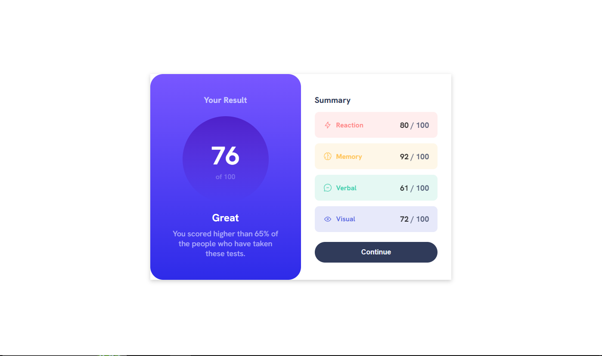
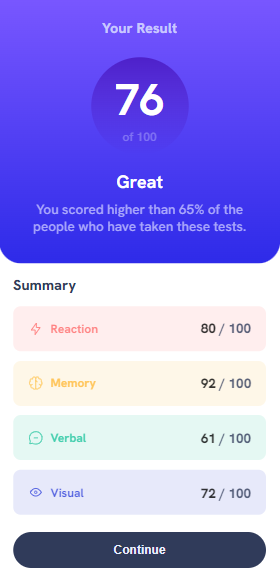

# Frontend Mentor - Results summary component solution

This is a solution to the [Results summary component challenge on Frontend Mentor](https://www.frontendmentor.io/challenges/results-summary-component-CE_K6s0maV). Frontend Mentor challenges help you improve your coding skills by building realistic projects.

## Table of contents

- [Overview](#overview)
  - [The challenge](#the-challenge)
  - [Screenshot](#screenshot)
  - [Links](#links)
- [My process](#my-process)
  - [Built with](#built-with)
  - [What I learned](#what-i-learned)
  - [Continued development](#continued-development)
  - [Useful resources](#useful-resources)
- [Author](#author)
- [Acknowledgments](#acknowledgments)

**Note: Delete this note and update the table of contents based on what sections you keep.**

## Overview

### The challenge

Users should be able to:

- View the optimal layout for the interface depending on their device's screen size
- See hover and focus states for all interactive elements on the page
- **Bonus**: Use the local JSON data to dynamically populate the content

### Screenshot




### Links

- Solution URL: [Add solution URL here](https://your-solution-url.com)
- Live Site URL: (https://triii3.github.io/results-summary-component-main/)

## My process

### Built with

- Semantic HTML5 markup
- CSS3
- Flexbox
- Mobile-first workflow

### What I learned

```html
<section class="circle-container">
  <section class="circle">
    <p id="result">76</p>
    <p id="total">of 100</p>
  </section>
</section>
```

adding an outer div/section helps the inner contents to not be affected by centering attributes

```css
body {
  height: 100vh;
  margin: auto;
  background-color: hsl(0, 0%, 100%);
  display: flex;
  justify-content: center;
  align-items: center;
}
```

    height: 100vh;
    display: flex;
    justify-content: center;
    align-items: center;

    - these four attributes help center all the elements to the center of the device

```css
main {
  display: flex;
  flex-direction: column;
  align-items: center;
}
```

    display: flex;
    align-items: center;

    - centers the widths of child-elements and not starting from
    the left (default)

```css
.circle-container {
  display: flex;
  width: 130px;
  height: 130px;
}
```

using percentage for height and width won't work since dimensions are not equal

```css
main .summaries .reaction {
  background-color: hsla(0, 100%, 67%, 0.1);
}
```

hsla(~, ~, ~, _opacity_);

- helps match the colour variation of the text

```css
@media screen and (min-width: 1280px) {
  main {
    width: 50%;
    flex-direction: row;
    box-shadow: 0 3px 10px rgb(0 0 0 / 0.2);
    align-items: stretch;
  }
}
```

by using the align-items: stretch; attribute it stretch then centered all the child-sections (.results and .summaries) inside the flex-box

### Continued development

I aim to prioritize the enhancement of proper HTML semantics for the webpages I will create in the future. Additionally, I intend to delve deeper into utilizing various attributes within flexbox, thereby enhancing the responsiveness and overall visual appeal of my webpages.

### Useful resources

- [Coding Fantasy](https://codingfantasy.com/games/flexboxadventure/play) - Playing the flexbox adventure game they had was a refreshing take on flexbox which helped me recall all the different attributes to style an element as well as discovering new ones.
- [Box Shadow - CSS-Tricks](https://css-tricks.com/almanac/properties/b/box-shadow/), [w3schools.com](https://www.w3schools.com/cssref/css3_pr_box-shadow.php) - Both of these websites helped me understand and visualize how box shadows are supposed to appear on a section of the page.

## Author

- GitHub Profile - [Triii](https://github.com/Triii3)
- Frontend Mentor - [@Triii3](https://www.frontendmentor.io/profile/Triii3)
- Twitter - [@TriiiCodes](https://twitter.com/TriiiCodes)

## Acknowledgments

I would like to express my gratitude to Chamu, a moderator at the FrontEnd Mentor discord server, for providing valuable feedback and guidance when I faced challenges. Their initial advice, followed by further assistance, proved immensely helpful. I truly value the insights they shared, which greatly aided me in tackling this challenge.
